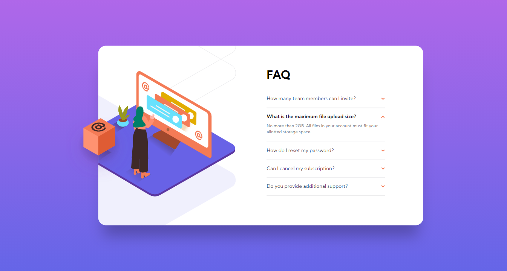

# Frontend Mentor - FAQ accordion card solution

This is a solution to the [FAQ accordion card challenge on Frontend Mentor](https://www.frontendmentor.io/challenges/faq-accordion-card-XlyjD0Oam). Frontend Mentor challenges help you improve your coding skills by building realistic projects. 

## Table of contents

- [Overview](#overview)
  - [The challenge](#the-challenge)
  - [Screenshot](#screenshot)
  - [Links](#links)
- [My process](#my-process)
  - [Built with](#built-with)
  - [What I learned](#what-i-learned)
  - [Useful resources](#useful-resources)
- [Author](#author)

## Overview

### The challenge

Users should be able to:

- View the optimal layout for the component depending on their device's screen size
- See hover states for all interactive elements on the page
- Hide/Show the answer to a question when the question is clicked

### Screenshot



### Links

- Solution URL: [Link](https://fahrulzul.github.io/fm-faq-accordion/)
- Live Site URL: [Link](https://fahrulzul.github.io/fm-faq-accordion/)

## My process

### Built with

- HTML
- SCSS
- Mobile-first workflow

### What I learned

1. **Transition:** Cannot transition `height`, use `min-height` or `max-height` instead.
2. **Box Shadow:** A negative value on `spread-radius` to make bottom shadow.

The bottom shadow of the accordion card for this solution:
```css
    box-shadow: 0px 45px 40px -15px rgba(0,0,0,0.25);
```


### Useful resources

- [More information on transition height.](https://stackoverflow.com/questions/3508605/how-can-i-transition-height-0-to-height-auto-using-css)
- [A collection of CSS tricks for box-shadow ](https://stackoverflow.com/questions/3508605/how-can-i-transition-height-0-to-height-auto-using-css)by [Brittany Chiang](https://brittanychiang.com/).

## Author

- Frontend Mentor - [@FahrulZul](https://www.frontendmentor.io/profile/FahrulZul)
